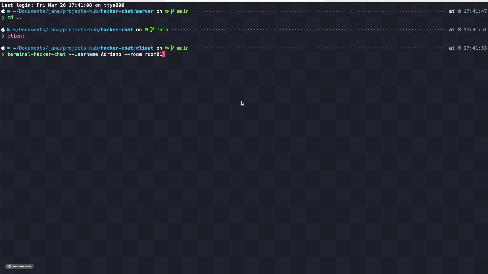

<p align="center">
    
    <h2 align="center" collor>Terminal Hacker Chat</h2>
</p>

<p align="center">
  
  
  
  
</p>

---

## Demo: :red_circle:

**Chat**:



---

## Description: :star:

<p>This project is a chat inside of terminal of your computer. With it is possible to connect several users and create new rooms.</p>

<p>The project includes the minimum of libraries, using the socket to make the sent and receiving of messages.</p>

<p>Exists two folders in the project:

  - **server**: Has the responsibility to manage the messages, new users in the room, close of the user, update of users in the room.
  - **client**: Create the interface inside of the terminal and make comunication between server and client changed some notifications.
</p>

---


## Getting started: :rocket:

**Process of installation in folder /server**

**install the dependencies:**

```sh
$ npm i or yarn
```

**run in environment development:**

```sh
$ npm run dev or yarn dev
```

This Project run on port `9898`

**Process of installation in folder /client**

**install the dependencies:**

```sh
$ npm i or yarn
```

**run in environment development:**

user of example:
```sh
$ npm run dev:user01 or npm run dev:user02
```
Enter with a new user:
```sh
$ terminal-hacker-chat --username {username} --room {room}
```

if the command **terminal-hacker-chat** no there available use this command:
```sh
$ npm link
```

---

<br>

Made by Janapc :metal: [Get in touch!](https://www.linkedin.com/in/janaina-pedrina/)